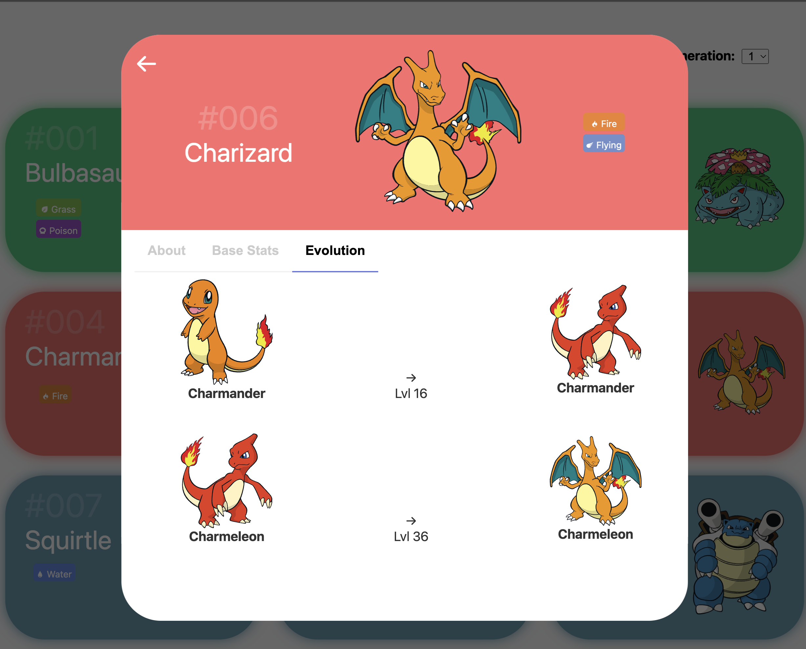
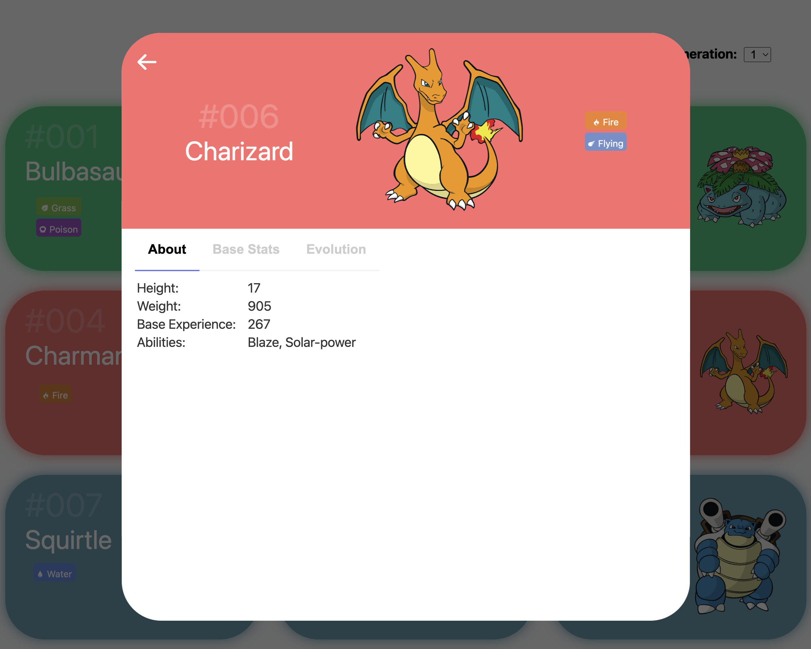
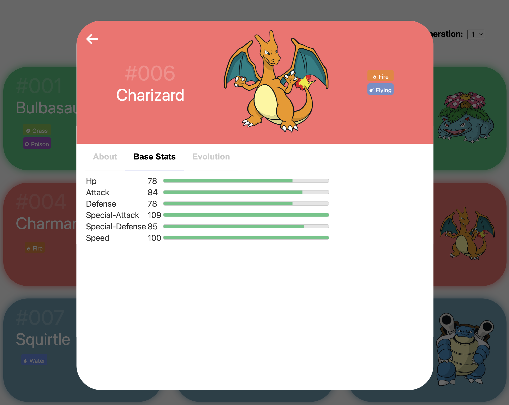

# Project Title

Pokédex React app that displays information about Pokémon using the [PokéAPI](https://pokeapi.co/).

## Table of Contents

- [About](#about)
- [Features](#features)
- [Getting Started](#getting-started)
  - [Installation](#installation)

## About

A Pokédex React app that displays information about Pokémon using the [PokéAPI](https://pokeapi.co/). Project was created to learn more about React, TypeScript and frontend development. There is a lot of room for improvement and I will work on it sometime in the future.

Generated the project using Vite and React with TypeScript template.

Other Pokedex projects used as reference:

- https://github.com/IdoBouskila/Pokedex
- https://github.com/StyleShit/react-pokedex

## Features

## Getting Started

### Installation

1. Clone the repository: git clone https://github.com/Jasoncheung94/react-pokdex.git
2. Navigate to the project directory: cd pokedex
3. Install dependencies: yarn install
4. Start the development server: yarn run dev
5. Run linter: yarn run lint
